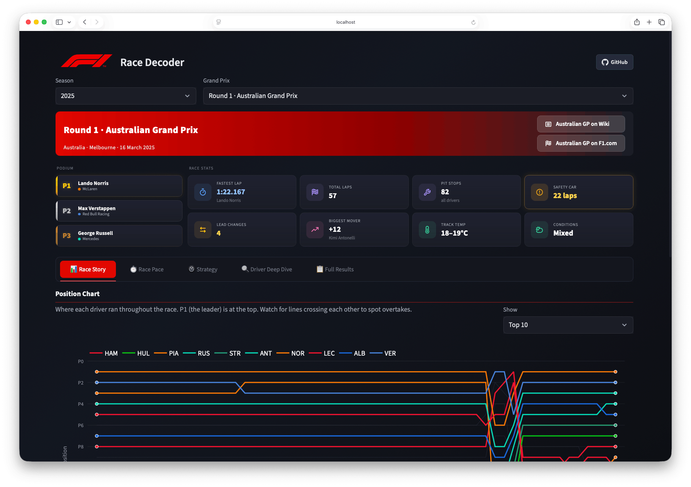
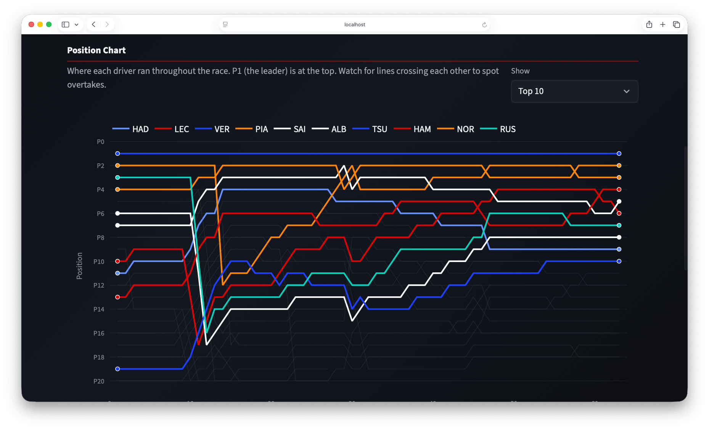
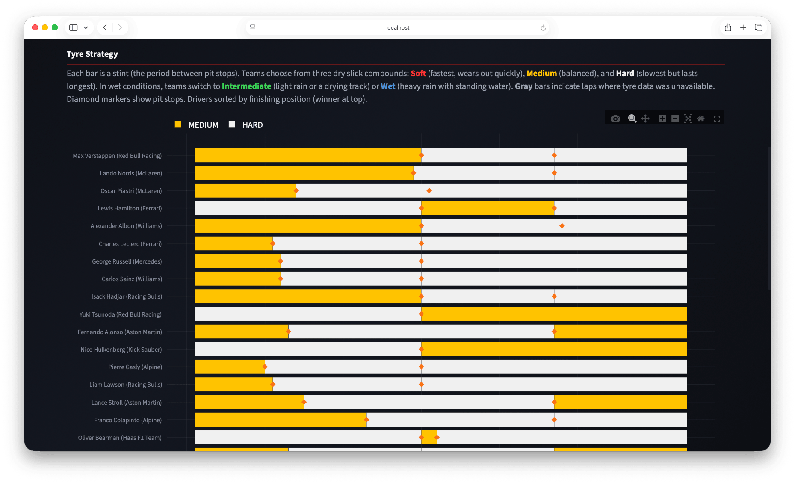
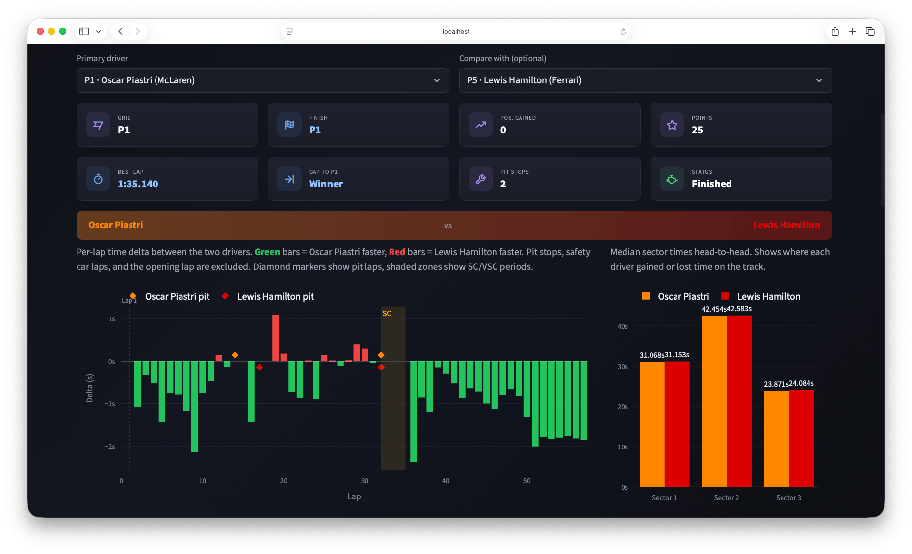

<h1> Race Decoder</h1>

     

A Formula 1 race analysis dashboard that turns raw timing data into interactive visualizations. Built with a data engineering backend where data flows from the FastF1 API through a multi-layer PostgreSQL data warehouse and surfaces in a Streamlit dashboard with Plotly charts.

Covers every race from **2018 to 2025**: 8 seasons, 173 grands prix, **189,000+ lap records**.

<p align="center">
  <a href="https://f1decoder.shivaang.com/">
    
  </a>
</p>

[](https://f1decoder.shivaang.com/)

| Race Story | Strategy | Driver Deep Dive |
|:---:|:---:|:---:|
| [](https://f1decoder.shivaang.com/) | [](https://f1decoder.shivaang.com/) | [](https://f1decoder.shivaang.com/) |

## Why I Built This

As an F1 fan, I always found myself jumping between multiple sites to piece together what actually happened in a race. So I built my own tool for it. Along the way, it turned into an excuse to work with real data engineering patterns: a proper layered warehouse, idempotent pipelines, fault-tolerant backfills across 170+ races, and a dashboard that tells the full story of each grand prix.

## Tech Stack

| Layer | Technology |
|-------|-----------|
| Data Source | [FastF1](https://github.com/theOehrly/Fast-F1) (unofficial F1 timing API) |
| Database | PostgreSQL 18, 4-schema warehouse (staging, curated, marts) |
| Pipeline | Python 3.12, psycopg, idempotent upserts with SHA1-based stable IDs |
| Dashboard | Streamlit 1.44, Plotly 6.0 |
| Infrastructure | Docker Compose (3 services), Makefile automation |

## Dashboard

**5 analysis tabs covering every angle of a race:**

- **Race Story** - See exactly when and where overtakes happened, with position changes and gap dynamics lap by lap
- **Race Pace** - Compare driver speed across the race with smoothed pace lines, consistency box plots, and sector-by-sector heatmaps
- **Strategy** - Visualize each team's tyre strategy as color-coded stint bars, and see how quickly each compound degrades
- **Driver Deep Dive** - Pick any two drivers for a head-to-head breakdown: per-lap time deltas, sector comparisons, and gap-to-leader overlays
- **Full Results** - Grid-vs-finish dumbbell chart showing who gained or lost the most, plus full race classification with CSV export

**At a glance:** Podium cards with team colors, 8 stat KPIs (fastest lap, safety car laps, lead changes, biggest mover, track conditions), and SC/VSC shading on every chart. Dark theme throughout.

## Architecture

```
FastF1 API
    |
 Extract --> Staging (raw typed) --> Curated (facts + dims) --> Marts (precomputed)
                                                                      |
                                                                 Streamlit App
```

The pipeline processes 173 races across 8 seasons, ingesting ~1,100 laps per race, 3 sectors per lap, 20 drivers, weather readings, and race control events into a 17-table PostgreSQL warehouse. The Streamlit app is **read-only**. It queries marts and curated tables via SQLAlchemy and never touches the external API.

## Technical Highlights

- **Idempotent ingestion** - SHA1-based deterministic IDs mean re-running the pipeline for any race produces identical results with no duplicates
- **Fault-tolerant backfill** - Multi-pass retry logic handles FastF1 API rate limits and transient failures across 173 races without manual intervention
- **Data quality gates** - Post-ingestion checks (primary key uniqueness, row count sanity, winner existence) prevent bad data from reaching the dashboard
- **Clean mart regeneration** - DELETE + INSERT per race ensures no stale aggregations survive a re-ingestion
- **4-schema warehouse pattern** - Staging, curated, and marts mirrors production data warehouse practices, with a metadata schema tracking every ingestion run
- **Graceful data gaps** - The pipeline synthesizes "UNKNOWN" stint records when the upstream API has missing tyre data, so the dashboard always shows complete race coverage

## Project Structure

```
app/
├── main.py              # Slim orchestrator (~200 lines)
├── data_access.py       # SQLAlchemy queries against curated/marts
├── charts/              # Plotly chart builders (6 modules)
├── components/          # Banner, metric cards, driver selector
├── tabs/                # One render module per tab
└── theme/               # Dark theme CSS + Phosphor icons

pipeline/
├── extract.py           # FastF1 fetch with exponential backoff
├── transform.py         # Staging + curated dataframe builders
├── load.py              # Upserts and mart replacements
├── marts.py             # Precomputed aggregations
└── quality.py           # Post-ingestion data quality checks

sql/                     # DDL for all 4 schemas (17 tables)
scripts/                 # Ingestion CLI + fault-tolerant backfill
docker/                  # Dockerfiles for streamlit + ingest containers
```

## Quick Start

```bash
# Clone and configure
git clone https://github.com/shivaaang/f1-race-decoder-dashboard.git
cd f1-race-decoder-dashboard
cp .env.example .env              # defaults work out of the box

# Start services and initialize the database
make up                           # postgres + streamlit
make db-bootstrap                 # create schemas and tables

# Ingest your first race
make ingest-single                # loads 2024 Bahrain GP

# Open the dashboard
open http://localhost:8501
```

**Backfill more data:**

```bash
make backfill-season SEASON=2024                        # one season
make backfill-safe SEASON_START=2018 SEASON_END=2025    # all seasons with automatic retries
```

## Database Schema

Four PostgreSQL schemas forming a classic data warehouse:

- **metadata** - Ingestion run tracking and data quality check results
- **staging** - Raw typed data (laps, results, weather) loaded as-is from FastF1
- **curated** - Star schema with fact tables (`fact_lap`, `fact_session_results`, `fact_race_control`, `fact_weather_minute`) and dimensions (`dim_race`, `dim_driver`, `dim_team`)
- **marts** - Dashboard-optimized tables: `mart_gap_timeline`, `mart_position_chart`, `mart_stint_summary`

## Development

**Code quality:** Ruff + Black with 100-character line length. Three separate requirements files (`requirements-ingest.txt`, `requirements-streamlit.txt`, `requirements-dev.txt`) for build isolation.

**Data quality:** Post-ingestion checks validate every race: primary key uniqueness, row count sanity, lap number continuity, and winner existence. Failed checks are logged to the `metadata` schema for auditability.

```bash
make lint                # ruff + black (check mode)
make format              # auto-format
make logs                # stream Docker logs
make reset-db            # hard reset, drops all data
```
